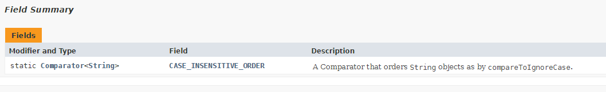
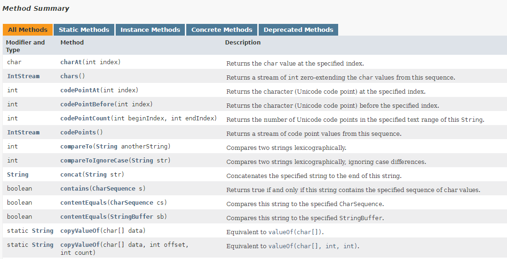

# Exceptions and how to use Javadoc
Competence: _I can use checked and unchecked exceptions (including custom created exceptions) and can explain the difference between the two._

Competence: _I can use the official Java specification._

The exercises are located in the individual submodules.

#Introduction
So far, to handle problems in your own application, you have used the classes `IllegalStateException` and 
`IllegalArgumentException` whenever something "went wrong". You used these exceptions in places to indicate that something 
"unexpected" happened (e.g., you try to take off with an airplane that has open doors) or that a value didn't make any
sense (e.g., a negative age).

By now you've also seen other examples of exceptions, such as the `FileNotFoundException` that is thrown when you try to 
open a file that does not exist. What you may also have noticed is that this exception _always_ has to be caught, while 
with the earlier mentioned `IllegalStateException` and `IllegalArgumentException` this was not the case: you *may* catch 
these exceptions, but this was not required. This is because of the superclasses from these exceptions (and is thus 
because of how exceptions inherit functionality). How exactly this works we're going to look at in more detail today.

What we also haven't discussed yet is what you do when you've found an error that is _so severe_ that an exception is not 
enough. Sometimes you want to indicate that something is really going _so terribly wrong_ that it can't be fixed anymore
inside the application and your program is going to crash. In this case, you want to throw a real "error" rather than an 
exception. Java already does this in several places: for example, if your computer's memory is full (`OutOfMemoryError`). 
We will discuss today what exactly the difference is between an exception and an error and how you can use this inside
your own programs.

Finally, we want to teach you where you can get your own information about classes you might not seen yet (apart from 
these readme files!). The past few programming courses (Intro. Progr. and this course) we often explained how _certain 
classes work_. But since we did not create all classes ourselves, we (as teachers) also had to look this up at some 
point. All this knowledge is fortunately contained within the _official Java (API) documentation_. In previous 
assignments / weeks, we have sometimes already referred you to these pages, but in some cases also (deliberately) not: 
This is mainly because the pages in the official documentation are sometimes _so technically written_, that they are 
practically unreadable for the novice programmer. At this point in your programming endeavours however, you've seen 
everything (static, non-static, abstract, final, methods, constructors, interfaces, etc.) you need to properly understand 
this documentation. (In short: You are ready!) And so we end this course with a brief lesson on "how to find out what
class I need and what that class does" (within Java).

However, we'll start with the topic of error handling!

# Error handling
As you already know, _exceptions_ are classes (in Java and other languages) that are used to handle problems in your 
program. In short, you can _throw_ an exception if something goes wrong.

The fact that you can _throw_ an exception (i.e. use it in conjunction with the `throws` keyword) is due to the fact that
the class `Exception` (and all subclasses of `Exception`) implements the interface `Throwable`. And anything that implements
the interface `Throwable` may be thrown with the keyword `throw`.

`Throwable` objects are used exclusively to handle problems in your application. As soon as you `throw` an exception, the 
normal flow of your software is interrupted and the problem must be fixed (_caught_) before the program can continue.

The `Exception` class is the most well-known `Throwable` implementation within Java. However, there is another class that 
implements the `Throwable` interface that we have not yet discussed, the `Error` class.

## Errors
An `Error` object is thrown the moment your program breaks _so much so that recovery is no longer possible_. You may have 
seen such an error before, such as the `OutOfMemoryError` when your computer runs out of memory or a `StackOverflowError` 
if you make too many stacked (recursive) method calls in your code. (Perhaps a runaway loop?)

The big difference between an `Error` and an `Exception` is that with an error you want to indicate that something happened
_that cannot be fixed_. So your program will (most likely) crash.

Within this course, you don't need to write your own `Error` classes. It is good to know that there are `Error` classes
and that you can treat them in the same way as `Exception`s, but creating your own `Error` classes is normally rare thing.

## Checked en unchecked exceptions
As described earlier, there are `Exception`s where you are _required_ to put a `try { ... } catch(..)` block around and
there are `Exception`s where you do not have to do this. Take for example the reading of a file: While trying to read
a file you can expect a `FileNotFoundException`, which will be thrown if the file cannot be found at the specified location
(or cannot be opened). If you try to read a file (e.g. with the `Scanner`), you _must_ put that code in a `try { ... } 
catch (..)` block. If you don't do this, your program will not compile.

This is different from throwing `IllegalStateException`s and `IllegalArgumentException`s as we have been doing since week 2.
This is because these last two exceptions are subclasses of the `RuntimeException` class. _Runtime_ in this
case, you find out _during the execution of the program_ that something is not going right. We have used these kinds of 
exceptions so far to indicate to methods (or constructors) that certain values were "unexpected" or that a method was 
called at a time when it should not have been. Both things we cannot always check before we run our application.

And exactly this last point is where it sometimes gets complicated: What can you expect in terms of checking and what 
not? When do you know when you can or cannot execute a method and what values are accepted? And if you do produce an
exception, how do you indicate that certain input will result in certain type of exception? In other words: Using
exceptions can also be considered using a "rule set", some input will result in certain exceptions, etc.

In most programming languages, this problem is solved by making a clear distinction between _checked_ and _unchecked 
exceptions_. Checked exceptions are exceptions that you can logically expect (such as a file that cannot be found, a 
network connection that fails, etc.) and _unchecked exceptions_ are exceptions that really entirely depend on what 
_possibly might happen during the execution of your program_ (e.g., you read a piece of data from a file and that data 
contains a character you can't parse).

Most of the _exceptions_ you will use while programming are _checked exceptions_. And this means you have to treat those
situations in a certain way. You've already seen the biggest change with regards to using _check exceptions_: They have 
to be handled with a `try { ... } catch (..)` block while _unchecked exceptions_ do not require this.

If you want to know a certain method call will produce either a _checked_ or _unchecked_ exception is something that you
usually best can find by reading the documentation.

Suppose we want to do the following.

```java
Scanner sc = new Scanner(new File("demo.csv"));
```

If we then open the documentation for the `Scanner` class and look for the constructor used in the example above, we will 
find the following information:


Especially the first line (with the methog signature) is important here: The constructor `public Scanner(File source" 
throws FileNotFoundException` indicates that upon initialization, the constructor may throw a `FileNotFoundException` if
the file cannot be found or opened.

The class `Scanner` expects the file "demo.csv" to exist and be readable. If this _isn't_ the case, this instance of 
the `Scanner` class suddenly becomes useless (you can't do anything useful with it). However, it is "logical" to expect
that a file does not exist or cannot be read (typo in the file name, no rights, etc.). And so the class `Scanner` states
that the _checked exception_ `FileNotFoundException` may be thrown _if something goes wrong here_. And since that chance 
exists you will therefore be _obligated_ to write code to resolve that situation should it occur. (The use of a _checked 
exception_ forces you to to come up with a solution for this kind of problem!)

By far the most classes that inherit from `Exception` in Java are examples of _checked exceptions_. And this is considered
to be a _good practice_: If you create a class that _really_ depends on something, make sure you point out all the problems
that you can reasonably expect to encounter when using that class and throw logical _checked exceptions_ when they occur. 
This way, it should be very clear for other programmers how to use your class / method and what exceptions they can expect 
while using your work.

## A total overview of exceptions
Because we can well imagine that you might get lost track of when to do what, we have created a "cheat sheet" sheet. 
Study the image carefully.


Let's create our own exception!

## Creating an Exception
Creating your own `Exception` is easier than you might think: You simply inherit from the class `Exception` and call the 
appropriate constructor of the class `Exception`. Let's make an `AirplaneException` class that we can use in the 
"airplane program" you have created a few times by now. This exception will belong exclusively to this program and
will focuses on exceptions specifically associated with our program. 

We create this exception in the following way:

```java
public class AirplaneException extends Exception {
    public AirplaneException(String message) {
        super(message);
    }
}
```
(The class `Exception` has a constructor to which you can pass a message (String). We will come back to this when we 
start reading the official Java documentation).

The use of the class `AirplaneException` however differs slightly from what you are used to so far, because we made 
`AirplaneException` a _checked_ exception. Suppose we want to use our own exception in the `depart()` method (instead of 
the `IllegalStateException` as we have done now), then this looks like this:

```java
public class Airplane {
    // Omitted a lot of code..
    
    public void depart() throws AirplaneException {
        if(!lockedDoors) {
            throw new AirplaneException("Doors must be locked before departure!");
        }
    }
}
```
(We used the `depart()` method to make a plane take off. This can only be done if the doors of the plane are closed!)

Notice that the `depart()` method now has an additional few words in its _signature_ indicating that this methow can 
throw _an `AirplaneException`_. This is mandatory for all _checked exceptions_ as it ensures that in places where you 
call the `depart()` method you now _must_ provide this code with a `try { ... } catch (..)` block.

```java
try {
    airplane.depart();
} catch (AirplaneException ae) {
    System.err.println(ae.getMessage());    
}

```

By the way, it is _really unusual_ to create a `RuntimeException` yourself. Normally you use the `RuntimeException` that 
are already present in Java by default. There is usually no need for it _and_ you don't have to specify that your method
throws an exception. In fact: You _can`t_ ever force a try-catch block around an unchecked exception. 

The code below does nothing:

```java
    public void depart() throws IllegalStateException { // You don't need to add the "throws" part.. RuntimeExceptions cannot be "forced" to be caught.
        if(!lockedDoors) {
            throw new IllegalStateException("Doors must be locked before departure!");
        }
    }

```

Adding the `throws <Exception>` syntax to a method definition also allows us to "pass exception" to the method that calls 
your method. With this, you can control where an exception is handled.

### "Passing on" exceptions
Sometimes you don't want to handle an exception directly in the method where it appears, but you just want to _pass_ 
the exception to the calling method so it knows that "something went wrong". 

Consider the following code:

```java
public class UserManager {

    private ArrayList<User> listOfUsers;

    public static void main(String[] args) {
        UserManager um = new UserManager("source-with-users.csv");
    }

    // constructor
    public UserManager(String fileName) {
        listOfUsers = loadUsersFromFile(fileName);
    }

    private ArrayList<User> loadUsersFromFile(String fileName) {
        ArrayList<User> result = new ArrayList<>();

        try {
            Scanner sc = new Scanner(new File(fileName));

            // Do parse stuff from data in that file

            sc.close();
        } catch (FileNotFoundException fnfe) { // We can expect all kinds of exceptions! FileNotFound, NumberFormat (from parsing), etc. 
            System.err.println(fnfe.getMessage());
        } catch (NumberFormatException nfe) {
            System.err.println("Unable to convert value: " + nfe.getMessage());
        }
        
        return result;
    }

}
```

Imagine that the class `UserManager` is based entirely on the data that is read from the file and is completely useless 
if this does not go well. If at any moment something goes wrong during the reading process, for example when opening the 
file or while parsing the data from the file, all possible errors in the method `loadUsersFromFile` will be handled right
there. For any exceptions during parsing, this may make sense: you can e.g. just skip the user and continue with the next 
line from the file. But if the _whole file_ can't be found or opened, then _really_ something is wrong.

So in that case, it makes more sense to _throw_ the `FileNotFoundException`_ back to the constructor where the method
`loadUsersFromFile` is called. This way, the constructor also knows that something went wrong. However, in this example
there is no reason for the constructor as well to do anything about it either: and so it makes more sense to _also_ pass 
the `FileNotFoundException` back to the code where the constructor is called. (In this case this is the code in the 
`main` method.)

In this way, by throwing a specific exception we ensure that the _right exception_ is passed to _the right place_.

If we want to make these changes to the code, it will look like this:

```java
public class UserManager {

    private ArrayList<User> listOfUsers;

    public static void main(String[] args) {
        UserManager um = new UserManager("source-with-users.csv");
    }

    // constructor
    public UserManager(String fileName) throws FileNotFoundException { // Any FileNotFoundExceptions thrown in the constructor, will be returned to the main method.
        listOfUsers = loadUsersFromFile(fileName);
    }

    public ArrayList<User> loadUsersFromFile(String fileName) throws FileNotFoundException { // We cannot deal with this exception here! Let's throw it back to the constructor.
        ArrayList<User> result = new ArrayList<>();

        Scanner sc = new Scanner(new File(fileName)); // This does not have to be inside the try-catch anymore, since we are passing on the exception to the constructor.

        try {
            // Do parse stuff from data in that file
        } catch (NumberFormatException nfe) { // Note that we are NO LONGER catching FileNotFoundException here!
            System.err.println("Unable to convert value: " + nfe.getMessage());
        }
        
        sc.close();
        
        return result;
    }
}
```

This way you can decide _when_ you want to handle an error (as long as you do it once). You can even choose to let the 
`main` method pass exceptions (throw them into "nothing"), but since this is _guaranteed_ to cause your program to crash, 
that really is an example of a _bad practice_: All `Exception`s have to be handled somehow!

## Try-catch... finally!
The above example introduces however another problem: As you learned last week, you should "close" files (and other 
external resources like e.g. Internet pages) after you're done reading them (to make sure the connection is properly 
closed). However, if a parse error occurs in the `UserManager` this will not happen. This is because the creation of the 
`Scanner` instance is no longer inside the `try { ... } catch (..)` block! So the file you open _will remain open even 
if an error occurred_. And that is almost always undesirable.

However, you can easily solve this problem by using the keyword `finally`. With `finally`, you can enter a
`try { ... } catch (..)` block to indicate what code should be executed _after_ an exception is handled. In this
case, you could include a piece of code that will neatly close the file, regardless of whether there were any errors
during parsing or not. (It will execute regardless whether an exception was thrown, or not.)

This looks like this:
```java
 public ArrayList<User> loadUsersFromFile(String fileName) throws FileNotFoundException { 
        ArrayList<User> result = new ArrayList<>();

        Scanner sc = new Scanner(new File(fileName));

        try {
            // Do parse stuff from data in that file
        } catch (NumberFormatException nfe) {
            System.err.println("Unable to convert value: " + nfe.getMessage());
        } finally { // Note that you can just put it underneath your catch blocks! It should be the "last block", similar to the else-statement in an if-else-if-etc. block.
            sc.close(); // After handling the previously mentioned exception, close the Scanner.
        }
        
        return result;
    }
```

You will see the word `finally` often used in situations where "external resources" (files, websites, etc.) are opened. 
You can read more about this in the documentation of these classes. This week we will also (somewhat) practice with this.

# Java Development Kit API Specification (a.k.a. "the javadoc")
The last part of the courses consists of learning how to read the official _Java Development Kit API Specification_. 
Over the past few weeks, we've regularly referred you to the _official documentation_, but this was always extra. Today 
we will discuss what you can actually find in this documentation and how you can best use these pages. We will therefore 
focus mainly on the "practical usefulness" of this documentation.

**Please note**: With the introduction of "smart" programming environments like IntelliJ, it has become much easier to see
what functionality a particular class has. However, IntelliJ still does not provide "the complete overview": when
should you use what class and how _does_ a particular class work internally are questions that are never answered. This 
_can_ only be obtained from reading the official documentation. Learning to use the official documentation properly (regardless 
of programming language) is therefore an important _skill_ that you must master as a programmer!

In the sections below, we will dissect an entire page for you so you know what to focus on while reading. For our 
convenience, we will use as example the class that you have used by far the most during your programming classes: the
class `String`.

We encourage you, while reading the information below, to also open the official page in a browser so that you can see 
our examples "in real life" as well. The easiest way to do this is to just Google for: "java String 11" (the last part 
ensures that you have the correct version of Java).

If all goes well you should be here: [Oracle description String class](https://docs.oracle.com/en/java/javase/11/docs/api/java.base/java/lang/String.html)

For practice, we also recommend that you keep a different class next to it, so you can practice reading these pages. An 
interesting example that you can use here is e.g. the class `ArrayList`. Especially focus on the similarities between
the different pages.

In this text however, we will focus on the class `String`.

## The location of the class in the entire Java hierarchy
As you know by now, inheritance is one of the most important parts of object-oriented programming and Java makes extensive 
use of this. However, it is sometimes difficult to see exactly what the supertypes of a particular class are and whether 
these classes implement certain interfaces.

Fortunately, this is _always_ listed at the top of the page:


From the image above we learn that a String inherits exclusively from the class `java.lang.Object` (which all classes
in Java inherit from), the interfaces `Serializable` (not discussed in this module), `CharSequence` (also not), and
`Comparable<String>` (this should sound familiar!) are implemented and the class belongs to the `java.lang` package.

Any properties, such as `final` or `abstract` can also be found here. Also, if the class is actually an interface
it will be shown here. In case a class has already been used as a base class (i.e. is a superclass for
other classes), the subclasss will be listed here as well. (Have a look at _Map_ for example!)

Next is the _official description_ of the class `String`, including examples of use. These we will skip these in this 
explanation and scroll down a little further to "Field summary".

## Field summary
The heading "Field summary" contains all _public_ static and non-static attributes (variables, not methods!) of the
class. In the case of the String class, there is only 1 attribute that matches these criteria, a `static` attribute 
called `CASE_INSENTIVE_ORDER` of the type `Comparator<String>`. We won't go into more detail about what exactly this is 
for now, but please find out for yourself! It has something to do with sorting...



If we scroll down a bit more, we find the following useful information at "Constructor summary".

## Constructor summary
The heading "Constructor summary" contains, as the name might suggest, a description of all possible
constructors that the class `String` knows. There are probably many more constructors than you would have thought, but 
this is mainly because the `String` class is _frequently_ used within Java when it comes to reading data.


Note that there are some constructor calls where the description includes **"Deprecated "**. Basically this means that
the specific constructor call is considered "obsolete" and will be removed in a later version of Java. (So if you want
your program to be easily updatable in the future, do not use these constructors!)

## Method summary
Below the list of constructors is the "Method summary", possibly _the_ most useful list of the entire page. In this
list you will find all the public and protected methods offered by the class, including return types and any
parameters. For ease of browsing, some filters are also included, these are:
- Static methods: shows only static methods. These methods belong to the class `String`.
- Instance methods: Only show the methods that are NOT static. So these methods belong to an instance of the class
  `String`.
- Concrete methods: Non-abstract methods. (The class String does not have any abstract methods, otherwise you would have
  seen a filter of them as well).
- Deprecated methods: Methods that will disappear in a future version of Java.



Note especially that on this page you can thus actually see _the entire definition_ of a method. You now know literally
everything about a method, except what exceptions it can potentially throw. This is described in the detailed description
of a method, which is at the bottom of the page. You can easily get to this by clicking on the name of a method.

## Method details
Once you have clicked on a method, you will see the details of this method. First, you'll see the official method 
_signature_, followed by a description. In this description you can see how the method should be used, what the individual 
parameters represent, what the method returns, and (possibly) by which interface / (abstract) superclass the method is
enforced. In the case of the method `charAt`, the method must be included based on the implementation of the interface
`CharSequence`. (If String didn't implement this method, it cannot be a `CharSequence`.)

You will also see any exceptions that may be thrown including the reason(s)) _why_ they are thrown. So if you ever come 
across this exception, you can easily find out what (supposedly) went wrong here. (Note that here no distinction
between _checked_ and _unchecked exceptions_. All possible exceptions are listed).


With this information, you can now read the official "javadoc"! The only question you can ask yourself now is which
class you want to use at what time. And this is actually where the _motto_ of programming anno 2021 comes in:

**Everyone uses Google!** (or a similar search engine)

Because at the time of writing there are over 5000 classes to be found in the Java library, it is almost impossible
to find "the right class" directly. In all programming modules so far we have used classes that 99% of
all programmers also use (String, Scanner, ArrayList, etc.), but most likely there are other classes out there that
always do _about_ what you want. So it is mainly a matter of _being to able to search properly_ and understand how you 
can use any given class based on their documentation. And that's exactly the subject we're going to practice with this 
week (too)!

At some point you will know most of the classes you are going to use "every day" by heart, but until then:
_learn to read the documentation carefully_ instead of trying to memorize literal code examples.