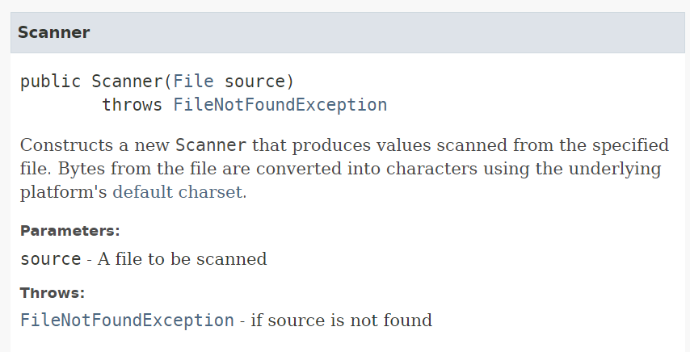
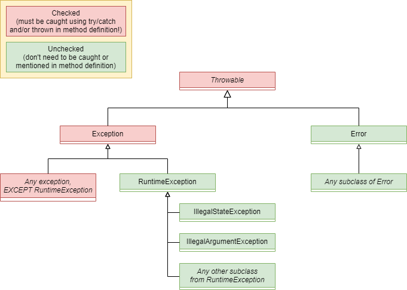
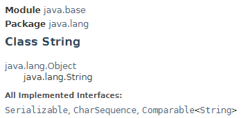
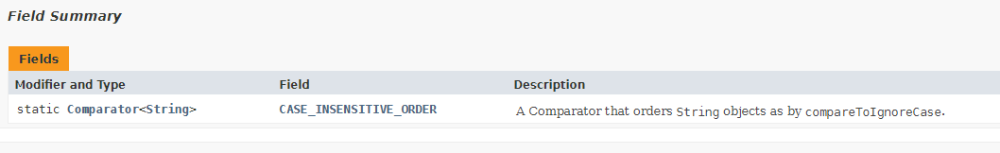
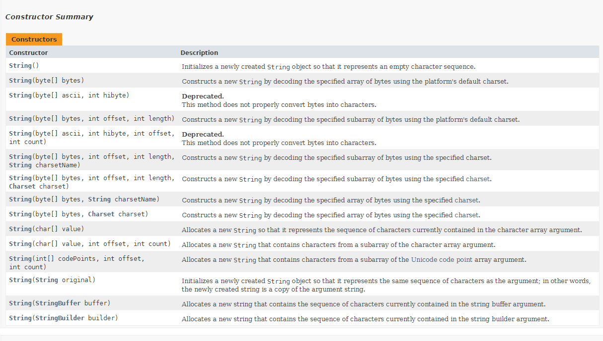
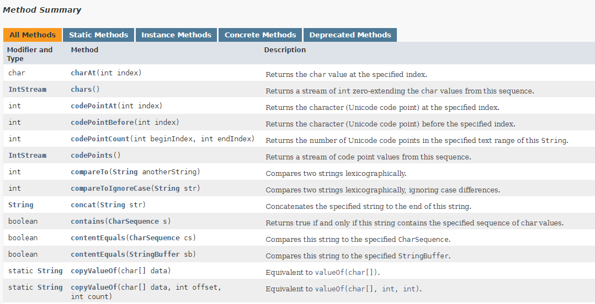
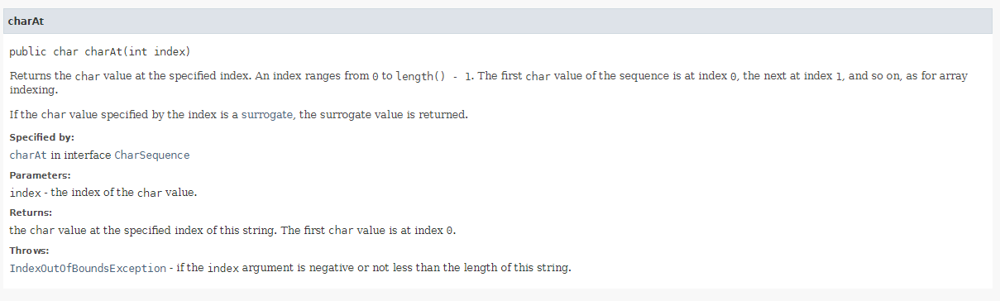

# Exceptions en het lezen van Javadoc
Competentie: _Ik kan checked en unchecked exceptions gebruiken (inclusief zelf gedefinieerde) en begrijp het verschil tussen de twee vormen._

Competentie: _Ik kan gebruik maken van de officiële Java documentatie._

De opdrachten staan in de losse modulen. 

# Introductie
Tot nu toe heb je, om fouten af te handelen in je eigen programma's, gebruik gemaakt van de klassen `IllegalStateException` 
en `IllegalArgumentException` om in je code aan te geven dat er iets niet goed gaat. Je gebruikte deze exceptions op
plekken om aan te geven dat er iets "onverwachts" gebeurde (bijv. je probeert een vliegtuig te laten opstijgen met openstaande
deuren) of dat er een argument werd meegegeven dat gewoon nergens op slaat (bijv. een negatieve leeftijd).

Je hebt ondertussen ook andere voorbeelden gezien van exceptions, zoals de `FileNotFoundException` die gegooid wordt als 
je een bestand probeert te openen dat niet bestaat. Wat je daarbij misschien ook is opgevallen is dat je deze exception 
_altijd moet vangen_, terwijl je dit bij de eerder genoemde `IllegalStateException` en `IllegalArgumentException` niet 
hoeft te doen: je *mag* ze afvangen, maar dit was niet verplicht. Dit heeft te maken met een stukje overerving dat 
gebruikt wordt bij exceptions. Hoe dit precies werkt gaan we vandaag verder bekijken.

Wat we ook nog niet besproken hebben is wat je doet als je een fout hebt gevonden die _zo ernstig is_ dat een exception 
(vertaald: "uitzondering") niet volstaat. Soms wil je aangeven dat er echt iets _zo mis gaat_ dat niet meer te verhelpen 
is en je programma zal gaan crashen. Je wil in dit geval een echte "foutmelding" (of _error_ in het Engels) gooien in
plaats van een exception. Java doet dit al op verschillende plekken: bijvoorbeeld als het geheugen van je computer vol 
zit (`OutOfMemoryError`). Wat precies het verschil tussen een exception en een error is (en wat jij hier 
mee moet) bespreken we vandaag. 

Tenslotte willen we je nog leren waar je zelf kennis vandaan kan halen (behalve deze readme bestanden!). De afgelopen 
modulen (Intro. Progr. en deze module) hebben wij je vaak uitgelegd hoe _klassen werken_. Maar aangezien wij natuurlijk
niet alle klassen zelf bedacht hebben hebben wij dit ooit ook moeten opzoeken. Al deze kennis staat gelukkig in de  
_officiële Java (API) documentatie_. Bij eerdere opdrachten / weken hebben wij je soms al naar deze pagina's verwezen, 
maar in sommige gevallen ook (opzettelijk) niet: Dit komt vooral omdat de pagina's in de officiële documentatie soms 
_zo technisch zijn geschreven_, dat ze praktisch onleesbaar zijn voor de beginnend programmeur. Op dit moment in de module 
echter heb je alles gezien (static, non-static, abstract, final, methoden, constructoren, interfaces, etc.) wat je nodig 
hebt om deze documentatie goed te kunnen begrijpen. En dus sluiten we de module af met de les over "hoe je zelf kan
vinden wat een klasse doet" (binnen Java).

We beginnen echter met het onderwerp foutafhandeling!

# Foutafhandeling
Zoals je inmiddels weet zijn _exceptions_ klassen (in Java en andere talen) die gebruikt worden als een manier om fouten 
af te handelen. Kort gezegd: Je kan een exception _gooien_ als er iets mis gaat. 

Het feit dat je een fout kan _gooien_ (dus kan gebruiken in combinatie met het keyword `throws`) komt door het feit dat
de klasse `Exception` (en alle subklassen van `Exception`) de interface `Throwable` implementeert. En alles wat `Throwable` 
is, mag je gooien met het keyword `throw`.

`Throwable` objecten worden uitsluitend gebruikt om fouten af te handelen in je programmatuur. Zodra je "een fout gooit",
wordt de normale flow van je programmatuur namelijk onderbroken en moet eerst het probleem worden opgelost voordat het 
programma weer door kan gaan.

De `Exception` klasse is de meeste bekende `Throwable` implementatie binnen Java. Er is echter nog een klasse die de 
`Throwable` interface implementeert die we nog niet besproken hebben, de `Error` klasse. 

## Errors
Een `Error` object wordt gegooid op het moment dat je programma _zodanig stuk gaat dat herstel niet meer mogelijk is_.
Mogelijk heb je al eens zo'n error gezien, zoals bijv. de `OutOfMemoryError` als je computer geen geheugen meer heeft 
(vol zit) of een `StackOverflowError` als je in je code te veel gestapelde (recursieve) methode-aanroepen uitvoert.

Het grote verschil van een `Error` ten opzichte van een `Exception` is dat je bij een error aan wil geven dat er iets 
gebeurd _dat niet meer te herstellen is_. Je programma zal dus (zeer waarschijnlijk) gaan crashen. 

Binnen deze module hoef je geen eigen `Error`-klassen te schrijven. Het is goed om te weten dat er `Error`s zijn
en dat je ze op eenzelfde manier kan behandelen als `Exception`s, maar verder is het zelf maken van `Error`-klassen
een redelijk zeldzaam iets.

## Checked en unchecked exceptions
Zoals eerder beschreven zijn er `Exception`s waar je _verplicht_ een `try { .. } catch(..)` block om heen moet zetten en 
zijn er `Exception`s waar je dit niet verplicht hoeft te doen. Neem bijvoorbeeld het inlezen van een bestand: Hier kan je 
een `FileNotFoundException` verwachten, dat gegooid zal worden als het bestand niet op de aangegeven locatie gevonden kan 
worden (of niet kan worden geopend). Als je een file probeert in te lezen (bijv. met de `Scanner`), _moet_ je deze code in 
een `try { .. } catch (..)` block opnemen. Als je dit niet doet, zal je programma niet compilen.

Dit is anders dan het gooien van `IllegalStateException`s en `IllegalArgumentException`s zoals we al vanaf week 2 doen. 
Dit komt omdat deze laatste twee exceptions subklassen zijn van de klasse `RuntimeException`. _Runtime_ betekent in dit 
geval dat je er _tijdens het uitvoeren van het programma_ achter komt dat iets niet goed gaat (of te wel: tijdens 
_runtime_). Wij hebben dit soort exceptions tot nu toe gebruikt om bij methoden (of constructoren) aan te geven dat 
bepaalde waarden "onverwacht" waren of dat er een methode werd aangeroepen werd op een moment dat dit eigenlijk niet kan.

En precies dit laatste punt is waar het soms ingewikkeld wordt: Wat mag je verwachten qua controle en wat niet? Wanneer 
weet je wanneer je een methode wel of niet mag uitvoeren en welke waarden worden geaccepteerd? En als je dan toch een
exception oplevert, hoe geef je aan dat bepaalde invoer zal leiden tot bepaald soort exception? 

In de meeste programmeertalen wordt dit probleem opgelost door een duidelijk onderscheid te maken tussen _checked_ en
_unchecked exceptions_. Checked exceptions zijn exceptions die je logischerwijs kan verwachten (zoals een bestand dat 
niet gevonden kan worden, een netwerkverbinding die wegvalt, etc.) en _unchecked exceptions_ zijn exceptions die echt 
volledig afhangen van wat er _mogelijk gebeurd tijdens de uitvoer van je programma_ (bijv. je leest een stukje data uit 
een bestand en die data bevat een teken dat je niet kan parsen).

Het grootste deel van de _exceptions_ die je zal gebruiken tijdens het programmeren zijn _checked exceptions_. En hier
zal je iets mee moeten doen. Het grootste verschil heb je al gezien: _Checked exceptions_ moet je afvangen met 
`try { .. } catch (..)` en _unchecked exceptions_ niet.

Hoe we weten of iets een _checked_ of _unchecked_  exception gooit kunnen we eigenlijk alleen maar weten door de 
documentatie te lezen.

Stel dat we het volgende willen doen..

```java
Scanner sc = new Scanner(new File("demo.csv"));
```

Als we dan de documentatie openen voor de `Scanner` klasse en op zoek gaan naar bovenstaande constructor, vinden we de 
volgende informatie:



Vooral de eerste regel is hier belangrijk: De constructor `public Scanner(File source" throws FileNotFoundException` geeft
aan dat de klasse bij initialisatie een `FileNotFoundException` kan gooien als het bestand niet gevonden of geopend kan
worden.

De klasse `Scanner` verwacht dat het bestand "demo.csv" bestaat en leesbaar is. Als dit _niet_ het geval is, is deze
instantie van de `Scanner` klasse opeens nutteloos geworden (je kan er niets mee). Het is echter "logisch" om te verwachten 
dat een bestand niet bestaat of niet gelezen kan worden (typo, geen rechten, etc.). En dus geeft de klasse `Scanner` aan 
dat de _checked exception_ `FileNotFoundException` gegooid _kan worden_ als hier iets mis gaat. En omdat die kans bestaat
zal je dus _verplicht_ hier rekening mee moeten houden. (Het gebruik van een _checked exception_ dwingt je dus als
het ware om een oplossing te verzinnen voor dit soort problemen!)

Verreweg de meeste klassen die erven van `Exception` in Java zijn voorbeelden van _checked exceptions_. En dit is gelijk 
een _good practice_: Als je een klasse maakt die ergens _echt_ van afhankelijk is, zorg er dan voor dat je alle fouten 
die je redelijkerwijs kan verwachten benoemd en logische _checked exceptions_ gooit als deze optreden. Het is voor
andere programmeurs op deze manier duidelijk hoe jouw klasse / methode gebruikt moet worden en welke fouten zij kunnen
verwachten met het gebruik van jouw code.

## Een totaaloverzicht van exceptions
Omdat we ons goed kunnen voorstellen dat je misschien kwijt bent wanneer je wat ook alweer moet doen hebben wij 
onderstaande afbeelding gemaakt als "spiekbriefje". Bestudeer de afbeelding goed.



Wij gaan ons nu richten op het _zelf_ maken van _checked_ exceptions.

## Zelf een Exception maken
Zelf een `Exception` maken is eenvoudiger dan je denkt: Je erft van de klasse `Exception` en roept de juiste constructor
van de klasse `Exception` aan. Neem bijvoorbeeld het volgende voorbeeld van het vliegtuig-voorbeeld dat we enkele malen 
gebruikt hebben in deze module. Stel dat we deze applicatie een _eigen_ exception willen geven die toegespitst zijn op
fouten die specifiek aan ons programma zijn gekoppeld. Dan kunnen we deze exception als volgt aanmaken:

```java
public class AirplaneException extends Exception {
    public AirplaneException(String message) {
        super(message);
    }
}
```
(De klasse `Exception` heeft een constructor waaraan je een bericht (String) mee kan geven. Hoe je dit kan weten komen
we zo op terug als we de officiële Java documentatie gaan lezen!)

Het gebruik van de klasse `AirplaneException` wijkt echter iets af van wat je tot nu toe gewend bent, omdat we hier
een _checked_ exception van hebben gemaakt. Stel dat we onze eigen exception nu in de methode `depart()` willen gaan 
gebruiken (in plaats van de `IllegalStateException` zoals we dit nu hebben gedaan), dan ziet dit er als volgt uit:

```java
public class Airplane {
    // Omitted a lot of code..
    
    public void depart() throws AirplaneException {
        if(!lockedDoors) {
            throw new AirplaneException("Doors must be locked before departure!");
        }
    }
}
```
(De `depart()` methode gebruikten we om een vliegtuig te laten opstijgen. Dit kan alleen maar als de deuren van het
vliegtuig dicht zitten!)

Merk op dat de methode `depart()` nu in de _signature_ heeft staan dat deze methode _een `AirplaneException` kan gooien. 
Het aangeven dat een methode (of constructor) een bepaalde exception kan gooien is verplicht voor alle _checked exceptions_.
Dit zorgt er namelijk dat je op plekken waar je `depart()` methode aanroept je nu deze code _moet_ voorzien van een 
`try { .. } catch (..)` block.

```java
try {
    airplane.depart();
} catch (AirplaneException ae) {
    System.err.println(ae.getMessage());    
}

```

Het is overigens _vrij ongebruikelijk_ om zelf een `RuntimeException` te maken. Normaal gesproken gebruik je de 
`RuntimeException`s die al standaard in Java aanwezig zijn. Dit zorgt er voor dat je in deze gevallen dus _niet_ bij de
methoden hoeft aan te geven of ze een exception gooien. Sterker nog: Je _kan_ nooit afdwingen dat je een _unchecked_ exception
moet afvangen. Onderstaande code doet dus niets:

```java
    public void depart() throws IllegalStateException { // You don't need to add the "throws" part.. RuntimeExceptions cannot be "forced".
        if(!lockedDoors) {
            throw new IllegalStateException("Doors must be locked before departure!");
        }
    }

```

Het toevoegen van de `throws <Exception>` syntax aan een methodedefinitie stelt ons tevens in staat om fouten "door te 
geven" naar de methode die jouw methode aanroept. Je kan hiermee zelf bepalen waar een exception wordt afgehandeld.

### Het "doorgooien" van exceptions
Soms wil je een exception niet direct afhandelen in de methode waar deze tevoorschijn komt, maar gewoon _voorbij laten 
gaan_ zodat de methode die mogelijk deze methode aanroept ook weet dat er "iets is fout gegaan". Beschouw de volgende
code:

```java
public class UserManager {

    private ArrayList<User> listOfUsers;

    public static void main(String[] args) {
        UserManager um = new UserManager("source-with-users.csv");
    }

    // constructor
    public UserManager(String fileName) {
        listOfUsers = loadUsersFromFile(fileName);
    }

    private ArrayList<User> loadUsersFromFile(String fileName) {
        ArrayList<User> result = new ArrayList<>();

        try {
            Scanner sc = new Scanner(new File(fileName));

            // Do parse stuff from data in that file

            sc.close();
        } catch (FileNotFoundException fnfe) { // We can expect all kinds of exceptions! FileNotFound, NumberFormat (from parsing), etc. 
            System.err.println(fnfe.getMessage());
        } catch (NumberFormatException nfe) {
            System.err.println("Unable to convert value: " + nfe.getMessage());
        }
        
        return result;
    }

}
```

Stel je voor dat de klasse `UserManager` volledig gebaseerd is op de data die ingelezen moet worden en verder volledig
nutteloos is als dit niet goed gaat. Als er op dit moment iets mis gaat tijdens het inlezen, bijvoorbeeld bij het openen
van het bestand of tijdens het parsen van de data uit het bestand, zullen alle mogelijke fouten in de methode 
`loadUsersFromFile` worden afgehandeld. Voor eventuele fouten tijdens het parsen is dit mogelijk logisch: je kan bijv.
de user gewoon overslaan en doorgaan met de volgende regel uit het bestand. Maar als het _gehele bestand_ niet gevonden 
of geopend kan worden, dan gaat er _echt_ iets mis.

In dit geval is het dus logischer om de `FileNotFoundException` _door te gooien_ naar de constructor waar de methode
`loadUsersFromFile` wordt aangeroepen. Op deze manier weet de constructor ook dat er iets mis gaat. In dit voorbeeld echter
is er ook geen reden voor de constructor om hier iets aan te doen: en dus is het logischer om ook _hier_ er voor te kiezen
om de `FileNotFoundException` weer door te geven naar de code waar de constructor wordt aangeroepen. (In dit geval is
dit de de code in de `main`-methode.)

Op deze manier zorgen we er voor dat de _juiste foutmelding_ wordt doorgestuurd naar _de juiste plek_.

Als we deze wijzigingen in de code willen doorvoeren, ziet dit er als volgt uit:

```java
public class UserManager {

    private ArrayList<User> listOfUsers;

    public static void main(String[] args) {
        UserManager um = new UserManager("source-with-users.csv");
    }

    // constructor
    public UserManager(String fileName) throws FileNotFoundException { // Any FileNotFoundExceptions thrown in the constructor, will be returned to the main method.
        listOfUsers = loadUsersFromFile(fileName);
    }

    public ArrayList<User> loadUsersFromFile(String fileName) throws FileNotFoundException { // We cannot deal with this exception here! Let's throw it back to the constructor.
        ArrayList<User> result = new ArrayList<>();

        Scanner sc = new Scanner(new File(fileName)); // This does not have to be inside the try-catch anymore, since we are passing on the exception to the constructor.

        try {
            // Do parse stuff from data in that file
        } catch (NumberFormatException nfe) { // Note that we are NO LONGER catching FileNotFoundException here!
            System.err.println("Unable to convert value: " + nfe.getMessage());
        }
        
        sc.close();
        
        return result;
    }
}
```

Op deze manier kan je zelf bepalen _wanneer_ je een fout wil afhandelen (zolang je het maar een keer doet). Je kan er zelfs 
voor kiezen om de `main`-methode exceptions te laten doorgooien, maar aangezien je hiermee _gegarandeerd_ je programma laat
crashen is dat echt een voorbeeld van een _bad practice_: Alle `Exception`s dienen op een of andere manier afgehandeld te 
worden!

## Try-catch.. finally!
Bovenstaand voorbeeld introduceert echter wel een ander probleem: Zoals je vorige week geleerd hebt dien je bestanden (en
andere externe resources zoals bijv. Internet pagina's), nadat je klaar bent met lezen, netjes te "sluiten" (om er voor 
te zorgen dat de verbinding goed verbroken wordt). Als er echter een parse fout wordt gevonden, zal dit in bovenstaande 
versie van de `UserManager` niet gebeuren. Het aanmaken van de Scanner valt namelijk niet meer onder het 
`try { .. } catch (..)` blok! Het bestand dat je opent, _zal dus geopend blijven als er een fout is opgetreden_. En dat
is vrijwel altijd onwenselijk.

Je kan dit probleem echter eenvoudig op te lossen met behulp van het keyword `finally`. Met `finally` kan je in een 
`try { .. } catch (..)` blok aangeven welke code er uitgevoerd moet worden _nadat_ een exception is afgehandeld. In dit
geval kan je bijvoorbeeld een stukje code opnemen dat het bestand netjes zal sluiten, ongeacht of er fouten zijn geweest 
tijdens het parsen of niet.

Dit ziet er als volgt uit:
```java
 public ArrayList<User> loadUsersFromFile(String fileName) throws FileNotFoundException { 
        ArrayList<User> result = new ArrayList<>();

        Scanner sc = new Scanner(new File(fileName));

        try {
            // Do parse stuff from data in that file
        } catch (NumberFormatException nfe) {
            System.err.println("Unable to convert value: " + nfe.getMessage());
        } finally { // Note that you can just put it underneath your catch blocks! It should be the "last block", similar to the else-statement in an if-else-if-etc. block.
            sc.close(); // After handling the previously mentioned exception, close the Scanner.
        }
        
        return result;
    }
```

Het gebruik van het woord `finally` zie je vooral in situaties waar "externe resources" (bestanden, websites, etc.) worden
geopend. In de documentatie van deze klassen lees je hier ook wel meer over. Hier gaan we deze week ook (een beetje) mee
oefenen.

# Java Development Kit API Specification (a.k.a. "de javadoc")
Het laatste onderdeel van de module bestaat uit het goed _leren lezen_ van de officiële _Java Development Kit
API Specification_/ De afgelopen weken hebben wij je regelmatig naar de _officiële documentatie_ verwezen, maar dit was
altijd extra. Vandaag bespreken we wat je nu eigenlijk in deze documentatie kan vinden en hoe je hier het beste
mee om kan gaan. We richten ons daarbij vooral op het "praktisch nut" van deze documentatie.

**Let op**: Met de komst van "slimme" programmeeromgevingen zoals IntelliJ is het veel eenvoudiger geworden om te zien
welke functionaliteit een bepaalde klasse heeft. Echter biedt IntelliJ nog steeds niet "het volledige overzicht": wanneer
gebruik je nu welke klasse en hoe _werkt_ een bepaalde klasse. Dit _kan_ je alleen maar halen uit de officiële 
documentatie. Het goed leren gebruiken van deze documentatie (ongeacht de programmeertaal) is dus een belangrijke _skill_ 
die je moet beheersen als programmeur!

In onderstaande paragrafen bespreken we de opbouw de beschrijving van een klasse in de officiële documentatie. Voor ons 
gemak gebruiken we hiervoor de klasse die jullie verreweg het meest gebruikt hebben tijdens je programmeerlessen: de 
klasse `String`.

We raden je aan om bij het lezen van onderstaande beschrijving ook de officiële pagina te openen in een browser zodat je
onze voorbeelden ook direct "in het echt" kan zien. Het makkelijkst kan je dit doen door gewoon even te Googelen naar: 
"java String 11" (de laatste toevoeging laatste zorgt er voor dat je de juiste versie van Java hebt).

Als het goed is kom je hier uit: [Oracle beschrijving String klasse](https://docs.oracle.com/en/java/javase/11/docs/api/java.base/java/lang/String.html)

Ter oefening raden we jullie ook aal om een _andere_ klasse er naast te houden, zodat je gelijk kan oefenen met het goed
lezen van dit soort pagina's. Een interessant voorbeeld dat je hier kan gebruiken is bijv. de klasse `ArrayList`. Probeer
vooral de overeenkomsten te zien _in de vorm_ van de verschillende pagina's.

De rest van de tekst gaat echter over de klasse `String`.

## De locatie van de klasse in de gehele Java hierarchie
Zoals je inmiddels weet is overerving een van de belangrijkste onderdelen uit het object georienteerd programmeren en
Java maakt hier veelvuldig gebruik van. Het is soms echter lastig om te zien wat nu precies de supertypen van een
bepaalde klasse zijn en of deze klassen bepaalde interfaces implementeren.

Gelukkig staat dit _altijd_ bovenaan de pagina:



Uit bovenstaande afbeelding halen we dat een String uitsluitend erft van de klasse `java.lang.Object` (waar alle klassen
in Java van erven), de interfaces `Serializable` (niet besproken in deze module), `CharSequence` (ook niet), en 
`Comparable<String>` (dit moet bekend klinken!) implementeert en behoort tot de `java.lang` package.

Eventuele eigenschappen, zoals `final` of `abstract` zijn hier ook te vinden. Ook als de klasse eigenlijk een interface
is zal dit hier benoemd worden. Mocht een klasse ook al eens als basisklasse gebruikt zijn (dus een superklasse zijn voor 
andere klassen), dan zal dat hier worden getoond. Ga maar eens op zoek naar de interface _Map_.

Vervolgens volgt de _officiële beschrijving_ van de klasse `String`, inclusief voorbeelden van gebruik. Deze slaan
wij in deze uitleg verder even over en scrollen iets verder naar beneden naar "Field summary".

## Field summary
Het kopje "Field summary" bevat alle _public_ static en non-static attributen (variabelen, dus geen methoden!)) van de 
klasse. In het geval van de klasse String is dit er slechts 1, een `static` attribuut genaamd `CASE_INSENTIVE_ORDER` van
het type `Comparator<String>`. We gaan voor nu niet verder in op wat dit precies is, maar zoek dit vooral zelf uit! Het 
heeft iets te maken met sorteren..



Scrollen we weer iets verder naar beneden, dan vinden we de volgende nuttige informatie: "Constructor summary".

##  Constructor summary
Het kopje "Constructor summary" bevat, zoals de naam mogelijk doet vermoeden, een beschrijving van alle mogelijke 
constructoren die de klasse `String` kent. Waarschijnlijk zijn dit er veel meer dan je gedacht had, maar dit komt vooral
omdat de `String` klasse _vaak_ gebruikt wordt binnen Java als het gaat om het inlezen van data.



Merk op dat er enkele constructor-aanroepen zijn waar in de beschrijving **"Deprecated"** is opgenomen. Het Engelse
woord "deprecated" betekent letterlijk "verouderd" en zegt in dit geval dat een nieuwere versie van Java deze constructor
aanroepen niet langer meer zal ondersteunen. Dus als je wil zorgen dat je code ook bij een nieuwere versie van Java 
blijft werken, kies er dan vooral _nu_ voor om die constructoren _niet_ te gebruiken!

## Method summary
Onder de lijst van constructoren staat de "Method summary", mogelijk _de_ nuttigste lijst van de gehele pagina. In deze
lijst vindt je alle publieke en protected methoden die de klasse aanbiedt, inclusief de return typen en eventuele
parameters. Voor het gemak van browsen zijn er ook enkele filters opgenomen, dit zijn:
- Static methods: Toont alleen statische methoden. Deze methoden behoren tot de klasse `String`.
- Instance methods: Toont alleen de NIET statische methoden. Deze methoden behoren dus tot een instantie van de klasse 
  `String`.
- Concrete methods: Niet-abstracte methoden. (De klasse String heeft verder geen abstracte methoden, anders had je hier 
  ook een filter van gezien.)
- Deprecated methods: Methoden die in een volgende versie van Java zullen verdwijnen.



Merk vooral op dat je op deze pagina dus eigenlijk _de gehele definitie_ van een methode kan zien. Je weet nu letterlijk 
alles van een methode, behalve welke exceptions deze mogelijk kan geven. Dit wordt beschreven in de detailbeschrijving 
van een methode, die onder aan de pagina staat. Je komt hier eenvoudig naar door te klikken op de naam van een methode.

## Method details
Als je op een methode hebt geklikt zien je de details van deze methode. Ten eerste zie je de officiële methode _signature_,
gevolgd door een beschrijving. In deze beschrijving kan je zien hoe de methode gebruikt dient te worden, wat de parameters
betekenen, wat de methode oplevert en (eventueel) door welke interface / (abstracte) superklasse de methode door wordt 
afgedwongen. In het geval van de methode `charAt` moet deze methode verplicht worden opgenomen om aan de interface 
`CharSequence` te voldoen.

Ook zie je eventuele exceptions die gegooid kunnen worden met de reden _waarom_ deze gegooid worden. Mocht je een dergelijke
fout dus ooit tegen komen, dan kan je hier vinden wat er (vermoedelijk) mis gaat. (Merk op dat hier geen onderscheid
wordt gemaakt tussen _checked_ en _unchecked exceptions_. Alle mogelijke fouten worden normaliter genoemd.)



Bij deze kunnen jullie ook de officiële "javadoc" lezen! De enige vraag die je jezelf nu nog kan stellen is welke
klasse je op welk moment wil gebruiken. En hier komt eigenlijk de _kern_ van het programmeren anno 2021 om de hoek:

**Iedereen gebruikt Google!** (of een vergelijkbare zoekmachine)

Omdat er op het moment van schrijven meer dan 5000 klassen in de Java library te vinden zijn is het bijna onmogelijk
om "de juiste klasse" direct te vinden. In alle programmeermodulen tot nu toe hebben wij klassen gebruikt die 99% van 
alle programmeurs ook gebruiken (String, Scanner, ArrayList, etc.), maar je kan het zo gek niet verzinnen of er bestaat 
waarschijnlijk wel een klasse voor die _ongeveer_ doet wat jij wil. Het is dus vooral een kwestie van _goed zoeken_ en
snappen hoe je iets kan gebruiken. En dat is precies het onderwerp waar we deze week (ook) mee gaan oefenen!

Op een gegeven moment zal je echter de meeste klassen die je "dagelijks" gaat gebruiken wel uit je hoofd kennen, maar 
_leer de documentatie goed lezen_ in plaats van dat je letterlijk codevoorbeelden gaat proberen te onthouden.