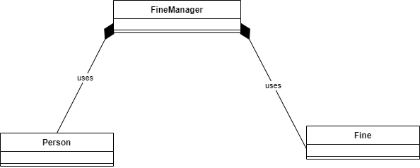
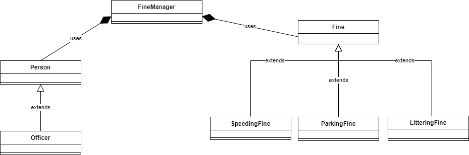

# Handing out fines (60 min)
In order to simplify the process of dealing with fines, the police acquired a piece of software to keep track of all fines
that are given out. It is possible both for police officers to give fines to regular citizens and for the fined (people 
who received a fine) to see which fines they have received and the reason why.

However, this program is outdated and in need of a major update. In this assignment you will implement this update.

The main requirements for this update are:
* Someone that received a fine must be able to pay a fine.
* Only officers may give fines to regular citizens.
    - This is not the case now - everyone can give fines!
* It must be possible to give different types of fines.
    - Currently, you can only be fined for parking incorrectly.

In order to do the assignment properly, it is important that you first understand how the current solution works. The 
best way to do this is to actually execute the code and study the solution as it is right now. For the sake of clarity, 
we have also included 2 class diagrams at the end of this description: one for the starting situation (current version) 
and one showing what your application should look like after doing this assignment. (We'll help you with the design, 
so you can focus on the actual implementation).

If you want to run the program, use the following users that we already added to the program:

| BSN number*       | Name           | Function  |
| ------------- |:-------------:| -----:|
| 123      | Rudy | Officer |
| 321      | Merlin      |   Citizen |

(* Note that a "BSN Number" is a personal identification number used in the Netherlands.)

Because this is quite a large task, we split the assignment several subassignments. A total overview of the output
of the _full version_ can be found at the end of the assignment.

## Assignment 1a: Paying fines.
The first requirement for the new version of the system is that anyone can pay a fine using the system. For this, we 
would like all fines (regardless of the type) to have a unique identification number. This number can then be used to 
select the right fine to pay. This number is not editable after the fine has been issued and must be unique throughout 
the system.

Once a fine is paid, it can be removed from the system entirely. There is no need to keep a history of fines.

## Assignment 1b: Only Officers are allowed to issue fines
What you may have noticed in assignment "a" is that a regular person is also allowed to issue fines. This is of course 
a little weird! Implement a solution in which you check whether the person who is logged in is actually a police officer 
and thus is allowed to issue fines. You will also have to modify the `Application` class to hide the menu item when you 
are not logged in as a police officer.

## Task 1c: Implement multiple types of fines
Currently, the system can only issue fines for illegal parking. There are of course multiple types of fines that you can
think of, so the system must be adapted in such a way that in the future you can (relatively) easily add new fines to the
system.

For now, implementing 2 additional fines for this task is sufficient: a `LitteringFine` and a `SpeedingFine`:
- A `LitteringFine` is given if you do not clean up your mess (in a park, the street, etc.). The costs for this
  type of fine is determined based on whether you polluted _intentionally_ or not. If it was clearly 
  _intentional pollution_ the fine is €100, otherwise the fine is only €20.
  (Tip: It is sufficient to save this fact as a `boolean` in your own class!)
- A `SpeedingFine` is given when you drive too fast. For this fine, the speed limit for the location where the fine was
  issued and the measured speed of the offender both need to registered. The costs for this fine are determined by the 
  degree of speeding. The standard amount for this fine is €200, but _per kilometer over the speed limit_ €25 is added. 
  (So going 90 km/h in a 80 km/h zone means that you are "10 km/hour speeding", which results in a €200 + 10 * 
  €25 = €350 fine.)

## Final requirements
This assignment is about improving an existing system. You are free to modify _any_ code we have given you. (In fact, 
you must!)

As far as the code is concerned, use (at least) the techniques you learned in this module. Try to avoid code duplication, 
use the right data types and make sure the responsibilities of classes are clear.

Furthermore, we expect you to (at least) code-check the following conditions (with exceptions) and give error messages
if the conditions are not met. 

At a minimum, check:
- The bsn number at login.
    - If the bsn number does not exist in the system you should get an error message.
- The id of the fine when paying fines.
    - If the id of the fine does not exist within the system, the fine is already paid for or it is not a fine of this 
      person (was issued to someone else), you should get an error.
- When creating a `SpeedingFine`, the measured speed and the maximum speed.
    - The measured speed must of course be above the maximum speed (otherwise you won't get a fine).
    - Both values must be positive (>0).
    - The maximum speed is also subject to the condition that you may not drive faster than 130 km/h anywhere in the 
      Netherlands.

Of course there are more possible exceptions you can think off.  You may add them if you want as long as you have also
implement the required checks above.

## Class Diagram
At the beginning of your program the class diagram will look like this:



At the very end of this assignment, your class diagram should look like this:



## Example
In the example below you will find a sample output of the _final_ application. So your job is to convert the
current application in such a way to mimic the output below. You have of course some freedom in the layout, as long as 
the requested functionality is available.

Note that in the example below we only enter _correct_ values to keep the example as simple as possible. You are allowed
to choose how to resolve invalid input.

```text
Please enter your BSN number: 123

1. Display my fines
2. Pay fine
3. Issue fine [Officers only]
9. Logout and change user
0. Exit

Please select an entry from the menu: 1
```
If there are no fines to display (because the user has none), the following message is displayed: 
```text
This user has no outstanding fines!
```

```text
1. Display my fines
2. Pay fine
3. Issue fine [Officers only]
9. Logout and change user
0. Exit

Please select an entry from the menu: 2
```
Similarly, if there are no fines to pay (because the user has none), the same message as before is shown:

```text
This user has no outstanding fines!
```

```text
1. Display my fines
2. Pay fine
3. Issue fine [Officers only]
9. Logout and change user
0. Exit

Please select an entry from the menu: 3

Please enter the BSN number of the offender: 321

What type of fine needs to be issued: 
1) Littering Fine
2) Parking Fine
3) Speeding Fine

What type of fine are you going to issue it: 1
Was the littering intentional? yes

1. Display my fines
2. Pay fine
3. Issue fine [Officers only]
9. Logout and change user
0. Exit

Please select an entry from the menu: 3

Please enter the BSN number of the offender: 321

What type of fine needs to be issued: 
1) Littering Fine
2) Parking Fine
3) Speeding Fine

What type of fine are you going to issue it: 2
What type of zone was the offender parking in? red

1. Display my fines
2. Pay fine
3. Issue fine [Officers only]
9. Logout and change user
0. Exit

Please select an entry from the menu: 3

Please enter the BSN number of the offender: 321

What type of fine needs to be issued: 
1) Littering Fine
2) Parking Fine
3) Speeding Fine

What type of fine are you going to issue it: 3
What was the speed limit? 80
What was the speed of the offender? 90
```
In the example above, we show what information is relevant for all types of fines. You need to implement the
menu and the interaction yourself.

```text
1. Display my fines
2. Pay fine
3. Issue fine [Officers only]
9. Logout and change user
0. Exit

Please select an entry from the menu: 9
```
The moment you log out you will see the same prompt as the one you get during the start of the application.

Note that this user (who is _not_ an officer!) does not see menu option 3 `Issue fine [Officers only]`.

```text
Please enter your BSN number: 321

1. Display my fines
2. Pay fine
9. Logout and change user
0. Exit

Please select an entry from the menu: 1

== Report for Merlin Elephant (321) ==

1: Littering [€ 20], issued by Rudy Dolphin
There is reason to believe this littering was unintentional
	
2: Parking in red zone [€ 100], issued by Rudy Dolphin
Offender was parked in a red zone.
	
3: Speeding [€ 450], issued by Rudy Dolphin
Offender was driving 90 in a 80 zone.

Total cost of all fines: € 570

1. Display my fines
2. Pay fine
9. Logout and change user
0. Exit

Please select an entry from the menu: 2

== Report for Merlin Elephant (321) ==

1: Littering [€ 20], issued by Rudy Dolphin
There is reason to believe this littering was unintentional

2: Parking in red zone [€ 100], issued by Rudy Dolphin
Offender was parked in a red zone.

3: Speeding [€ 450], issued by Rudy Dolphin
Offender was driving 90 in a 80 zone.

Total cost of all fines: € 570

Please enter the id of the fine that you want to pay: 2
Fine 2 is paid for!

1. Display my fines
2. Pay fine
9. Logout and change user
0. Exit

Please select an entry from the menu: 1

== Report for Merlin Elephant (321) ==

1: Littering [€ 20], issued by Rudy Dolphin
There is reason to believe this littering was unintentional

3: Speeding [€ 450], issued by Rudy Dolphin
Offender was driving 90 in a 80 zone.

Total cost of all fines: € 470
```