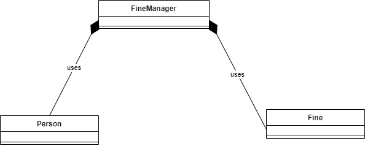

# Bekeuringen uitdelen (60 min)
Om het proces rondom bekeuringen eenvoudiger te maken heeft de politie enige tijd geleden een programma aangeschaft waarmee
het zowel mogelijk is om door politieagenten bekeuringen te laten invoeren, als voor de bekeurden om in te zien welke
bekeuringen zij hebben ontvangen. Dit programma is echter verouderd en toe aan een grote update. In deze opdracht gaan jullie
deze update implementeren. 

De voornaamste wensen voor deze update zijn:
* Je moet bekeuringen kunnen betalen.
* Alleen agenten mogen bekeuringen invoeren.
  - Dit is nu niet het geval!
* Er moeten verschillende soorten bekeuringen kunnen worden gegeven.
  - Op dit moment kan je alleen een boete krijgen voor fout parkeren.

Om de opdracht goed te kunnen uitvoeren is het belangrijk dat je eerst snapt hoe de huidige oplossing werkt. Je kan 
hiervoor uiteraard het beste de code uitvoeren en goed lezen. Voor de duidelijkheid hebben wij aan het eind van de
opdrachtbeschrijving ook 2 klassendiagrammen opgenomen: van de beginsituatie en hoe je klassen er aan het eind van de
opdracht er uit horen te zien. (We helpen je met het ontwerp, zodat jij je alleen maar op de implementatie hoeft
te richten.)

Mocht je het programma willen uitvoeren, gebruik dan de volgende gebruikers die reeds in het programma aanwezig zijn:

| BSN nummer        | Naam           | Rol  |
| ------------- |:-------------:| -----:|
| 123      | Rudy | Agent |
| 321      | Merlin      |   Burger |

Om de opdracht overzichtelijk te houden splitsen we de opdracht enkele subopdrachten. Een totaaloverzicht van de uitvoer
van de _volledige versie_ is te vinden aan het eind van de opdracht.

## Opdracht 1a: Het betalen van boetes
De eerste wens voor de nieuwe versie van het systeem is dat je een boete kan betalen. Hiervoor wil men graag dat alle boetes
(ongeacht het soort) een eigen uniek nummer krijgen. Dit nummer kan vervolgens gebruikt worden om de juiste boete
te selecteren om deze te betalen. Dit nummer is uiteraard niet aanpasbaar nadat de boete is uitgedeeld.

Zodra een boete betaald is mag deze uit het systeem verwijderd worden. Er hoeft geen geschiedenis van boetes te worden
bijgehouden.

## Opdracht 1b: Alleen agenten mogen bekeuren
Wat je misschien is opgevallen bij opdracht "a" is dat een burger ook bekeuringen mag uitdelen. Dit is uiteraard niet
de bedoeling! Implementeer een oplossing waarbij je controleert of de persoon die ingelogd is ook daadwerkelijk een
agent is en bekeuringen mag uitdelen. Je zal hiervoor ook de `Application` klasse moeten aanpassen om het menu-item
te verbergen als je niet bent ingelogd als agent.

## Opdracht 1c: Implementeer meerdere soorten bekeuringen
Op dit moment kan het systeem alleen maar bekeuringen uitschrijven voor verkeerd parkeren. Er zijn natuurlijk meerdere
soorten bekeuringen te bedenken, dus het systeem moet zodanig worden aangepast dat je ook in de toekomst relatief eenvoudig
nieuwe bekeuringen kan toevoegen.

Voor nu volstaat het implementeren van 2 extra bekeuringen voor deze opdracht: een `LitteringFine` en een `SpeedingFine`:
- Een `LitteringFine` krijg je als je niet netjes je rotzooi opruimt (in een park, de straat, etc.). De kosten voor dit
type bekeuring wordt bepaald op basis van de vraag of je het _opzettelijk_ hebt gedaan of niet. Als er sprake is van 
  _opzettelijke vervuiling_ bedraagt de boete €100,-, mocht dit niet het geval zijn is de boete slechts €20,-. 
  (Tip: Het is voldoende om dit feit als `boolean` op te slaan in je eigen klasse!)
- Een `SpeedingFine` krijg je als je te hard rijdt. Voor deze bekeuring moeten de maximale snelheid van de locatie en 
  de gemeten snelheid van de bekeurde geregistreerd worden. De kosten voor deze bekeuring worden bepaald door de mate 
  waarin te snel wordt gereden. Het standaardbedrag voor deze boete is €200, maar hier komt _per te snel gereden 
  kilometer_ nog €25 boven op. (10 km te hard gereden is dus een boete van €200 + 10 * €25 = €350)

## Overige eisen
In deze opdracht gaat het natuurlijk om het verbeteren van een bestaand systeem. Je bent hierbij vrij om _alle_ code aan
te passen die wij gegeven hebben. (Sterker nog: Je moet wel!)

Voor wat betreft de code geldt natuurlijk dat je (in elk geval) de technieken gebruikt die je in deze module geleerd hebt.
Probeer codeduplicatie te voorkomen, gebruik de juiste datatypen en zorg dat de verantwoordelijkheden van klassen duidelijk
zijn.

Verder verwachten we dat je (op zijn minst) codematig de volgende zaken controleert (met exceptions) en foutmeldingen geeft 
als niet aan de voorwaarden wordt voldaan. Controleer op zijn minst: 
- Het bsn nummer bij het inloggen. 
  - Als het bsn nummer niet voorkomt in het systeem krijg je een foutmelding.
- Het id van de boete bij het betalen van boetes. 
  - Als het id van de boete niet voorkomt, de boete reeds betaald is of het niet een boete is van deze persoon is (want 
    alle boetes krijgen een uniek id), krijg je een foutmelding.
- Bij het aanmaken van een `SpeedingFine` de gemeten snelheid en de maximale snelheid.
  - De gemeten snelheid moet uiteraard boven de maximale snelheid liggen (anders hoef je geen bekeuring te krijgen). 
  - Beide waarden moeten in elk geval positief zijn (>0).
  - Voor de maximale snelheid geldt verder de voorwaarde dat in Nederland je niet harder dan 130 km / uur mag rijden.

Uiteraard zijn er nog wel meer fouten te verzinnen, deze mag je uiteraard toevoegen zolang je bovenstaande controles
in elk geval maar hebt geïmplementeerd.

## Klassediagram
Aan het begin van je programma ziet het klassendiagram er als volgt uit:



Aan het eind van de opdracht ziet je oplossing er als volgt uit:


## Voorbeeld
In onderstaand voorbeeld vindt je een voorbeelduitvoer van de _uiteindelijke_ applicatie. Het is dus jouw taak om de
huidige applicatie zo om te zetten dat je onderstaande uitvoer weet na te bootsen. Je hebt uiteraard enige vrijheid
in de layout, zolang de gevraagde functionaliteit maar beschikbaar is.

Merk op dat we in onderstaand voorbeeld alleen _correcte_ waarden worden ingevoerd om het voorbeeld overzichtelijk 
te houden. Je mag zelf bepalen hoe je omgaat met ongeldige invoer. 

```text
Please enter your BSN number: 123

1. Display my fines
2. Pay fine
3. Issue fine [Officers only]
9. Logout and change user
0. Exit

Please select an entry from the menu: 1
```
Als er geen boetes zijn om te laten zien krijg je de volgende melding:
```text
This user has no outstanding fines!
```

```text
1. Display my fines
2. Pay fine
3. Issue fine [Officers only]
9. Logout and change user
0. Exit

Please select an entry from the menu: 2
```
Als er geen boetes zijn, zijn er natuurlijk ook geen boetes om te betalen. Dus krijg je dezelfde melding als hiervoor.
```text
This user has no outstanding fines!
```

```text
1. Display my fines
2. Pay fine
3. Issue fine [Officers only]
9. Logout and change user
0. Exit

Please select an entry from the menu: 3

Please enter the BSN number of the offender: 321

What type of fine needs to be issued: 
1) Littering Fine
2) Parking Fine
3) Speeding Fine

What type of fine are you going to issue it: 1
Was the littering intentional? yes

1. Display my fines
2. Pay fine
3. Issue fine [Officers only]
9. Logout and change user
0. Exit

Please select an entry from the menu: 3

Please enter the BSN number of the offender: 321

What type of fine needs to be issued: 
1) Littering Fine
2) Parking Fine
3) Speeding Fine

What type of fine are you going to issue it: 2
What type of zone was the offender parking in? red

1. Display my fines
2. Pay fine
3. Issue fine [Officers only]
9. Logout and change user
0. Exit

Please select an entry from the menu: 3

Please enter the BSN number of the offender: 321

What type of fine needs to be issued: 
1) Littering Fine
2) Parking Fine
3) Speeding Fine

What type of fine are you going to issue it: 3
What was the speed limit? 80
What was the speed of the offender? 90
```
In bovenstaand voorbeeld laten we zien welke informatie relevant is voor alle soorten bekeuringen. Je dient zelf het
menu en de interactie te implementeren in jouw uitwerking.
```text
1. Display my fines
2. Pay fine
3. Issue fine [Officers only]
9. Logout and change user
0. Exit

Please select an entry from the menu: 9
```
Op het moment dat je uitlogt krijg je hetzelfde prompt te zien als dat je ook bij het opstarten te zien krijgt. 

Let er bij deze gebruiker (die dus _geen_ agent is!) op dat menuoptie 3 `Issue fine [Officers only]` dus niet getoond 
wordt.

```text
Please enter your BSN number: 321

1. Display my fines
2. Pay fine
9. Logout and change user
0. Exit

Please select an entry from the menu: 1

== Report for Merlin Elephant (321) ==

1: Littering [€ 20], issued by Rudy Dolphin
There is reason to believe this littering was unintentional
	
2: Parking in red zone [€ 100], issued by Rudy Dolphin
Offender was parked in a red zone.
	
3: Speeding [€ 450], issued by Rudy Dolphin
Offender was driving 90 in a 80 zone.

Total cost of all fines: € 570

1. Display my fines
2. Pay fine
9. Logout and change user
0. Exit

Please select an entry from the menu: 2

== Report for Merlin Elephant (321) ==

1: Littering [€ 20], issued by Rudy Dolphin
There is reason to believe this littering was unintentional

2: Parking in red zone [€ 100], issued by Rudy Dolphin
Offender was parked in a red zone.

3: Speeding [€ 450], issued by Rudy Dolphin
Offender was driving 90 in a 80 zone.

Total cost of all fines: € 570

Please enter the id of the fine that you want to pay: 2
Fine 2 is paid for!

1. Display my fines
2. Pay fine
9. Logout and change user
0. Exit

Please select an entry from the menu: 1

== Report for Merlin Elephant (321) ==

1: Littering [€ 20], issued by Rudy Dolphin
There is reason to believe this littering was unintentional

3: Speeding [€ 450], issued by Rudy Dolphin
Offender was driving 90 in a 80 zone.

Total cost of all fines: € 470
```